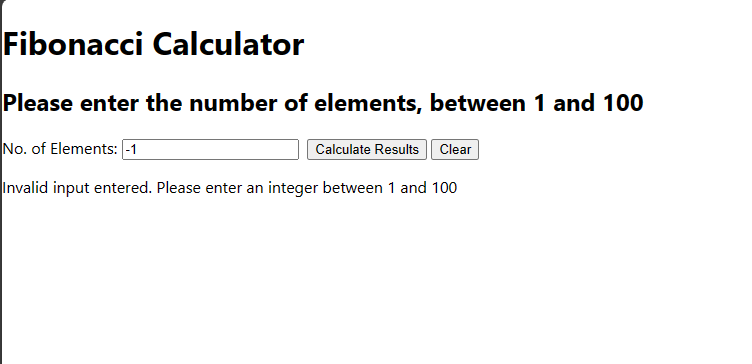

Running the Program

Challenge 1: REST Web Service 

Prerequisites:

NPM installed
Java installed

For starting the Java API Backend in Dropwizard:

1. cd SIT_Chang_Wee_Siang_Wilson_fibonacci/
2. java -jar target/fibonacci-1.0-SNAPSHOT.jar server config.yml

This will start the API hosted locally at port 8000

For starting the React Server:

1. cd SIT_Chang_Wee_Siang_Wilson_fibonacci/my-app
2. npm start

This will start the frontend React Server hosted locally at port 3000.

Entering a number between 1 and 100 will return the JSON for the Fibonacci sequence for that number of elements,
as well as the sorting criteria as given in the outline.

Entering invalid inputs such as negative numbers, values greater than 100 or non-integer values will trigger a warning message. 

Challenge 2: Docker

This challenge is not fully implemented as the functionality of the original service is not fully functional.
However, in their seperate containers, they are able to start and run using Docker-Compose.

Creating the Docker image for the Java API

1. cd SIT_Chang_Wee_Siang_Wilson_fibonacci/
2. docker build -t fibonaccibackend .

Creating the Docker image for the React Server

1. cd SIT_Chang_Wee_Siang_Wilson_fibonacci/my-app
2. docker build -t fibonaccifrontend .

Starting the Docker environment for both applications

1. cd SIT_Chang_Wee_Siang_Wilson_fibonacci/
2. docker-compose build
3. docker-compose up -d

Once not in use, run the following command to close the containers

1. docker-compose down

Challenge 3: Oracle Cloud integration

Unfortunately, due to time limit and inexperience, I was unable to deploy the application on to Oracle Cloud. 